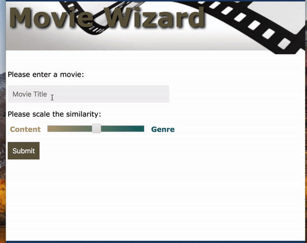
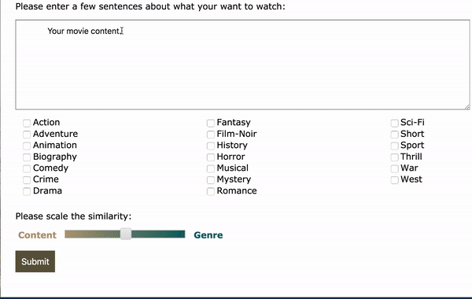

# Project_Fletcher - A content based movie recommendation system
This movie recommendation system is based on NLP analysis on movie scripts and genre info on ~1000 movies scripts from imsdb.com. 

`get_imsdb_data.py`: download movie scripts from IMSDB  
`preprocess_text.py`: preprocess the movie scripts text before tf-idf transformation  
`make_nmf_topics.ipynb` and `movie_similarity.ipynb`: topic modeling and similarity calculation   

An interactive app was created for the recommendation system:
1. **Version without showing the movie poster:** Use `recommendation_app.py` and `movie_rec.html`
2. **Versino with movie poster:** Use `recommendation_app_with_poster.py` and `movie_rec_with_poster.html`. To use this version, you need to put a `poster` folder containing all the posters in the `static` folder. In the code, each movie is give an Id and the poster image is named with the movieId. 

A demo of the app.  
Using movie title as the input:

Using movie plot as the input:

Please check my [blog post](https://caiy7.github.io/content-based-rec-system/) for more information.  